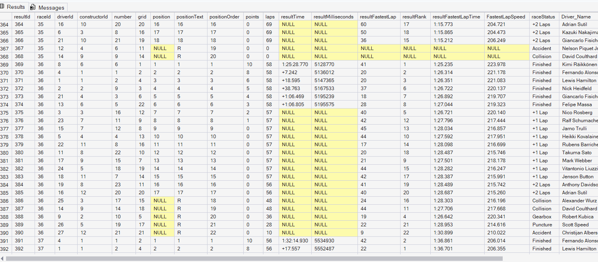
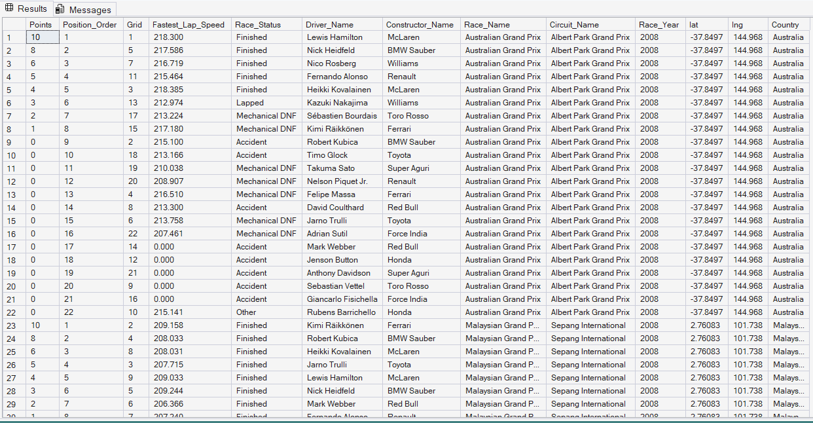
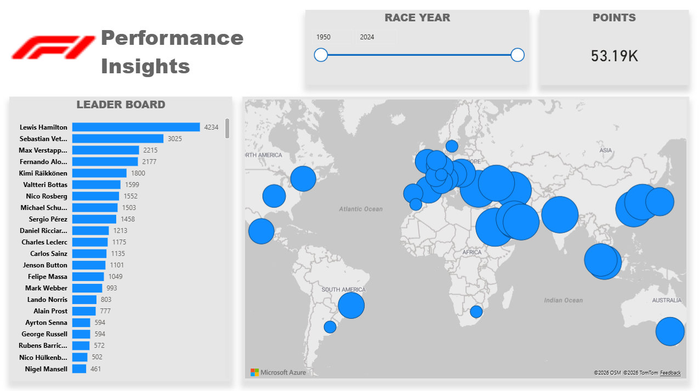

# F1-Data-Warehouse

**Created by:** Ishrakuzzaman Emon  

This project demonstrates a full-scale Data Engineering and Analytics pipeline from raw CSV ingestion and SQL-based ETL transformations to high-level performance reporting using the Medallion Architecture.

---

## 🛠️ Pipeline Architecture

The project follows a modular **Medallion Architecture** to ensure data integrity and analytical readiness:

* **Bronze Layer (Ingestion):** Raw data is ingested from CSV files into a SQL Server environment using Python.
* **Silver Layer (Transformation):** SQL views are used to clean, join, and standardize racing metrics.
* **Gold Layer (Analysis):** Complex T-SQL queries extract deep insights into driver and constructor performance.
* **Presentation Layer (Visualization):** An interactive Power BI dashboard provides a bird's-eye view of the sport's history.

---

## 🏗️ 1. Data Ingestion (Python & SQL)

The core database is built on a relational schema that connects drivers, constructors, circuits, and race results.

# Database Schema (ERD)
The schema defines relationships between 11 primary tables to capture every aspect of a race weekend, from pit stops to qualifying.

### Automated Loading Script
A Python script utilizing `SQLAlchemy` and `pandas` automates the ingestion of raw CSVs into SQL Server.

* **Automation:** Handles batch loading for all 11 files (e.g., `results.csv`, `lap_times.csv`).
* **Data Integrity:** Replaces empty strings (`\N`) with SQL `NULL` values during the upload process.

---

## 🧹 2. Data Cleaning & Transformation (Silver Layer)

Racing data is notoriously messy. I used a SQL View (`vw_PowerBI_F1_Performance`) to normalize the data for reporting.

# Key Transformation Logic:
* **Status Categorization:** Over 100 specific race statuses are consolidated into five clean categories: `Finished`, `Lapped`, `Mechanical DNF`, `Accident`, and `Other`.
* **Metric Casting:** Converts `fastestLapSpeed` from a string to a decimal format for mathematical analysis.
* **Feature Engineering:** Concatenates `forename` and `surname` into a single `Driver_Name` field.

---

## 📈 3. Analytical Insights (Gold Layer)

Deep-dive analysis into team and driver performance.

* **Overtaking Capability:** The pipeline identifies aggressive drivers by calculating the average positions gained (`Grid - Position_Order`) across all races they finished.
* **Reliability Metrics:** Tracks the **DNF (Did Not Finish)** percentage for every constructor to identify which teams struggle with mechanical failures vs. driver accidents.
* **Circuit Velocity:** Calculates track speed records and average points-per-driver for every circuit on the global calendar.

---

## 📊 4. Performance Insights Dashboard

The final output is an interactive Power BI dashboard.

### Dashboard Features:
* **All-Time Leaderboard:** Ranks drivers by total career points (e.g., Lewis Hamilton leading with 4234+ points).
* **Global Circuit Map:** Visualizes the geographic spread of Formula 1 races across the globe.
* **Temporal Filters:** Allows users to filter performance data by specific race years (1950–2024).

---

### Dashboard Features:
* **All-Time Leaderboard:** Ranks drivers by total career points (e.g., Lewis Hamilton leading with 4,234 points).
* **Global Circuit Map:** Visualizes the geographic spread and frequency of Formula 1 races across the globe.
* **Temporal Filters:** Allows users to filter performance data across a wide range of race years (1950–2024).
